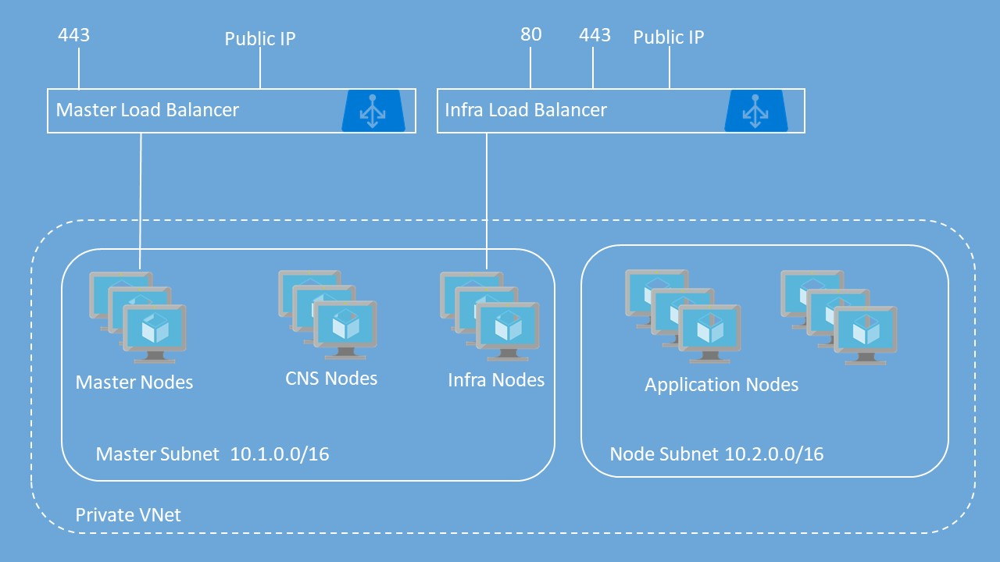

# OpenShift Container Platform Deployment using Ansible

## Playbook

Playbook is available here:

https://github.com/Microsoft/openshift-container-platform/tree/master/ansible


## Prerequisites

- Ansible 2.7.x
- Azure service principal
- SSH public and private keys generated

## Setting up OpenShift

Copy **vars.example.yml** to **vars.yml** and edit the file to update all the variables with your information.

In general the only thing you will have to do is to make sure you have proper SSH keys available. By default your private key will be used from **~/.ssh/id_rsa**. Copy your public key content to **admin_pubkey:**


Run the playbook:

```bash
ansible-playbook playbooks/create.yml -e @vars.yml
```
This playbook will deploy OpenShift Container Platform with basic username / password for authentication to OpenShift. It includes the following resources:

|Resource           	|Properties                                                                                                                          |
|-----------------------|------------------------------------------------------------------------------------------------------------------------------------|
|Virtual Network <br />Default  		|**Address prefix:** 10.0.0.0/14<br />**Master subnet:** 10.1.0.0/16<br />**Node subnet:** 10.2.0.0/16                      |
|Master Load Balancer	|1 probe and 1 rule for TCP 443                                       |
|Infra Load Balancer	|2 probes and 2 rules for TCP 80 and TCP 443									                                           |
|Public IP Addresses	|Bastion Public IP for Bastion Node<br />OpenShift Master public IP attached to Master Load Balancer (if masters are public)<br />OpenShift Router public IP attached to Infra Load Balancer (if router is public)           |
|Storage Accounts|1 Storage Account for Registry|
|Network Security Groups|1 Network Security Group for Bastion VM<br />1 Network Security Group Master VMs<br />1 Network Security Group for Infra VMs<br />1 Network Security Group for Node VMs |
|Availability Sets      |1 Availability Set for Master VMs<br />1 Availability Set for Infra VMs<br />1 Availability Set for Node VMs  |
|Virtual Machines   	|1 Bastion Node - Used to Run Ansible Playbook for OpenShift deployment<br />1, 3 or 5 Master Nodes<br />1, 2 or 3 Infra Nodes<br />User-defined number of Nodes (1 to 30)<br />All VMs include a single attached data disk for Docker thin pool logical volume|




## Playbook Explanation

Playbook execution can be divided into a few phases. During these phases tasks run in parallel to save time

During fist phase following resources are created in parallel:
- Public IP addresses
- subnets
- network security groups
- availability sets

In the second phase following resources are created:
- load balancers for master and infrastructure nodes
- network interfaces for bastion, master, infra and node VMs
- storage - synchronous

In the third phase:
- bastion VM
- master VMs
- node VMs
- infra VMs

In the fourth phase, after all the virtual machines are successfully deployed:
- execute custom scripts on master infra and node VMs to set them up using **azure_rm_virtualmachine_extension** module - these tasks are performed asynchronously, but we won't wait for the result
- execute tasks on bastion VM to install OpenShift - these tasks will be performed synchronously


## Parameters Explanation

## azuredeploy.Parameters.json File Explained
| Property                          | Description                                                                                                                                                                                                                                                                                                                                          | Valid options                                                                        | Default value |
|-----------------------------------|------------------------------------------------------------------------------------------------------------------------------------------------------------------------------------------------------------------------------------------------------------------------------------------------------------------------------------------------------|--------------------------------------------------------------------------------------|---------------|
|`location`|Azure region for deployment|||
|`resource_group`|Resource group name|||
|`cluster_prefix`|Cluster name prefix, used as prefix for VM names|||
|`master_count`|Number of Masters nodes to deploy||3|
|`infra_count`|Number of infra nodes to deploy||3|
|`node_count`| Number of Nodes to deploy||2|
|`vm_size_master`|Size of the Master VM.||Standard_D2s_v3|
|`vm_size_infra`|Size of the Infra VM.||Standard_D4s_v3|
|`vm_size_node`|Size of the App Node VM.|| Standard_D2s_v3|
|`vm_size_bastion`|Size of the Bastion Node VM.||Standard_D2s_v3|
| `osImageType`                     | The RHEL image to use.                                                                                                                                                                                                                                                                                                                               | "defaultgallery" (On-Demand RHEL)<br><br>"marketplace" (3rd party Marketplace image) | defaultgallery    |
| `marketplaceOsImage`              | If `osImageType` is marketplace, then enter the appropriate values for 'publisher', 'offer', 'sku', 'version' of the marketplace offer. This is an object type                                                                                                                                                                                       |                                                                                      |               |
| `storageKind`                     | The type of storage to be used.                                                                                                                                                                                                                                                                                                                      | - "managed"<br>- "unmanaged"                                                         | managed       |
| `openshiftClusterPrefix`          | Cluster Prefix used to configure hostnames for all nodes - bastion, master, infra and app nodes. Between 1 and 20 characters                                                                                                                                                                                                                         |                                                                                      |               |
| `data_disk_size`                    | Size of data disk to attach to nodes for Docker volume                                                                                                                                                                                                                                                                                               | - 32 GB<br>- 64 GB<br>- 128 GB<br>- 256 GB<br>- 512 GB<br>- 1024 GB<br>- 2048 GB     | 64            |
| `admin_username`                   | Admin username for both OS (VM) login and initial OpenShift user                                                                                                                                                                                                                                                                                     |                                                                                      | ocpadmin      |
| `openshiftPassword`               | Password for OpenShift user                                                                                                                                                                                                                                                                                                                          |                                                                                      |               |
| `enableMetrics`                   | Enable Metrics                                                                                                                                                                                                                                                                                                                                       | - "true"<br>- "false"                                                                | false         |
| `enableLogging`                   | Enable Logging                                                                                                                                                                                                                                                                                                                                       | - "true"<br>- "false"                                                                | false         |
| `enableCNS`                       | Enable Container Native Storage (CNS)                                                                                                                                                                                                                                                                                                                | - "true"<br>- "false"                                                                | false         |
| `rhsmUsernameOrOrgId`             | Red Hat Subscription Manager Username or Organization ID. To find your Organization ID, run on registered server `subscription-manager identity`.                                                                                                                                                                                                    |                                                                                      |               |
| `rhsmPasswordOrActivationKey`     | Red Hat Subscription Manager Password or Activation Key for your Cloud Access subscription. You can get this from [here](https://access.redhat.com/management/activation_keys).                                                                                                                                                                      |                                                                                      |               |
| `rhsmPoolId`                      | The Red Hat Subscription Manager Pool ID that contains your OpenShift entitlements for compute nodes                                                                                                                                                                                                                                                 |                                                                                      |               |
| `rhsmBrokerPoolId`                | The Red Hat Subscription Manager Pool ID that contains your OpenShift entitlements for masters and infra nodes. If you don't have different pool IDs, then enter the same pool ID as 'rhsmPoolId'                                                                                                                                                    |                                                                                      |               |
| `sshPublicKey`                    | Copy your SSH Public Key here                                                                                                                                                                                                                                                                                                                        |                                                                                      |               |
| `keyVaultResourceGroup`           | The name of the Resource Group that contains the Key Vault                                                                                                                                                                                                                                                                                           |                                                                                      |               |
| `keyVaultName`                    | The name of the Key Vault you created                                                                                                                                                                                                                                                                                                                |                                                                                      |               |
| `keyVaultSecret`                  | The Secret Name you used when creating the Secret (that contains the Private Key)                                                                                                                                                                                                                                                                    |                                                                                      |               |
| `enableAzure`                     | Enable Azure Cloud Provider                                                                                                                                                                                                                                                                                                                          | - "true"<br>- "false"                                                                | true          |
| `aadClientId`                     | Azure Active Directory Client ID also known as Application ID for Service Principal                                                                                                                                                                                                                                                                  |                                                                                      |               |
| `aadClientSecret`                 | Azure Active Directory Client Secret for Service Principal                                                                                                                                                                                                                                                                                           |                                                                                      |               |
| `masterClusterDnsType`            | This will either be default (if you don't have your own domain) or custom if you have your own domain name that you would like to use for accessing the OpenShift web console                                        | default<br>custom           | default       |
| `masterClusterDns`                | The custom DNS name you would like to use to access the OpenShift web console if you selected custom above.  If you selected default above, you must still enter something here but it will not be used              |                             |               |
| `routingSubDomainType`            | This will either be nipio (if you don't have your own domain) or custom if you have your own domain that you would like to use for routing                                                                           | nipio<br>custom             | nipio         |
| `routingSubDomain`                | The wildcard DNS name you would like to use for routing if you selected custom above.  If you selected nipio above, you must still enter something here but it will not be used                                      |                             |               |
| `virtualNetworkNewOrExisting`     | Select whether to use an existing Virtual Network or create a new Virtual Network                                    | - "existing"<br>- "new"     | new           |
| `virtualNetworkName`              | The name of the new Virtual Network to create. Not used if 'existing' selected above                    |            | openshiftvnet    |
| `addressPrefixes`                 | Address prefix of the new virtual network                                     |         | 10.0.0.0/14   |
| `masterSubnetName`                | The name of the master subnet                                                 |         | mastersubnet  |
| `masterSubnetPrefix`              | CIDR used for the master subnet - needs to be a subset of the addressPrefix   |         | 10.1.0.0/16   |
| `infraSubnetName`                 | The name of the infra subnet                                                  |         | infrasubnet   |
| `infraSubnetPrefix`               | CIDR used for the infra subnet - needs to be a subset of the addressPrefix    |         | 10.2.0.0/16   |
| `nodeSubnetName`                  | The name of the node subnet                                                   |         | nodesubnet    |
| `nodeSubnetPrefix`                | CIDR used for the node subnet - needs to be a subset of the addressPrefix     |         | 10.3.0.0/16   |
| `existingMasterSubnetReference`   | Full reference to existing subnet for master nodes                            |         |               |
| `existingInfraSubnetReference`    | Full reference to existing subnet for infra nodes                             |         |               |
| `existingCnsSubnetReference`      | Full reference to existing subnet for cns nodes                               |         |               |
| `existingNodeSubnetReference`     | Full reference to existing subnet for compute nodes                           |         |               |
| `masterClusterType`               | Specify whether the cluster uses private or public master nodes. If private is chosen, the master nodes will not be exposed to the Internet via a public IP. Instead, it will use the private IP specified in the next parameter.                                                                                                                    | - "public"<br>- "private"                                                            | public        |
| `masterPrivateClusterIp`          | If private master nodes is selected, then a private IP address must be specified for use by the internal load balancer for master nodes. This will be a static IP so it must reside within the CIDR block for the master subnet and not already in use. If public master nodes is selected, this value will not be used but must still be specified. |                                                                                      | 10.1.0.200    |
| `routerClusterType`               | Specify whether the cluster uses private or public infra nodes. If private is chosen, the infra nodes will not be exposed to the Internet via a public IP. Instead, it will use the private IP specified in the next parameter.                                                                                                                      | - "public"<br>- "private"                                                            | public        |
| `routerPrivateClusterIp`          | If private infra nodes is selected, then a private IP address must be specified for use by the internal load balancer for infra nodes. This will be a static IP so it must reside within the CIDR block for the master subnet and not already in use. If public infra nodes is selected, this value will not be used but must still be specified.    |                                                                                      | 10.2.0.201    |
| `customHeaderImage`               | URL to a custom image for the header in the web console. If no valid image type is specified then it will use the default. 20px is the default height as well      |            |               |
| `routingCertType`                 | Use custom certificate for routing domain or the default self-signed certificate - follow instructions in **Custom Certificates** section                          | selfsigned<br>custom       | selfsigned      |
| `masterCertType`                  | Use custom certificate for master domain or the default self-signed certificate - follow instructions in **Custom Certificates** section                           | selfsigned<br>custom       | selfsigned      |
| `proxySettings`                   | Use custom proxy settings                                                                                           | none<br>custom             | none            |
| `httpProxyEntry`                  | If custom proxy settings selected, enter http_proxy settings to use                                                 |                            | none            |
| `httpsProxyEntry`                 | If custom proxy settings selected, enter https_proxy settings to use                                                |                            | none            |
| `noProxyEntry`                    | If custom proxy settings selected, enter no_proxy settings to use                                                   |                            | none            |
